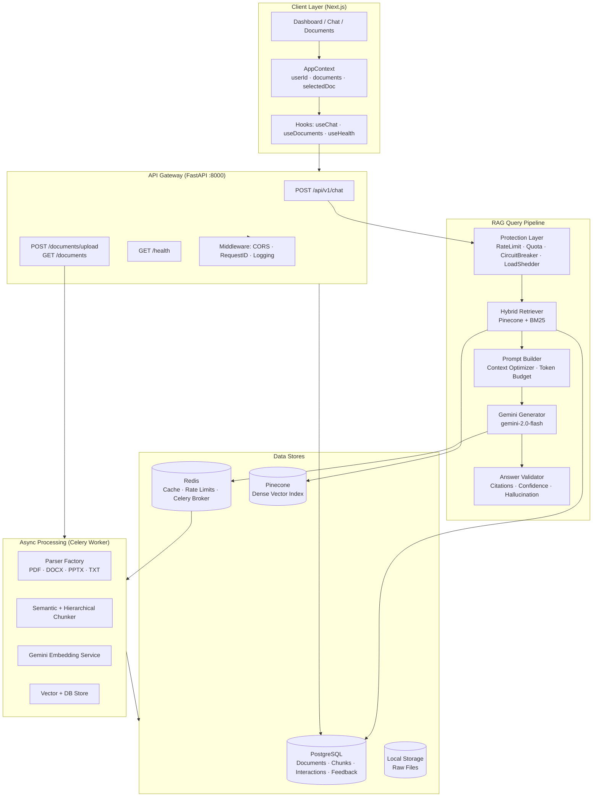
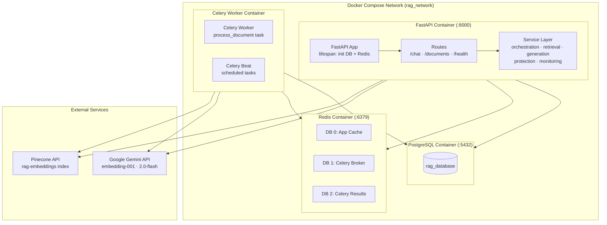
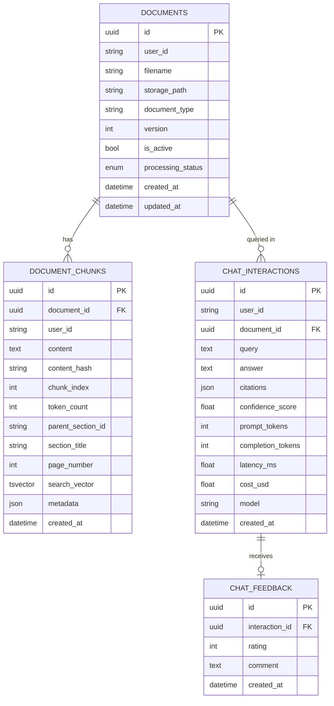
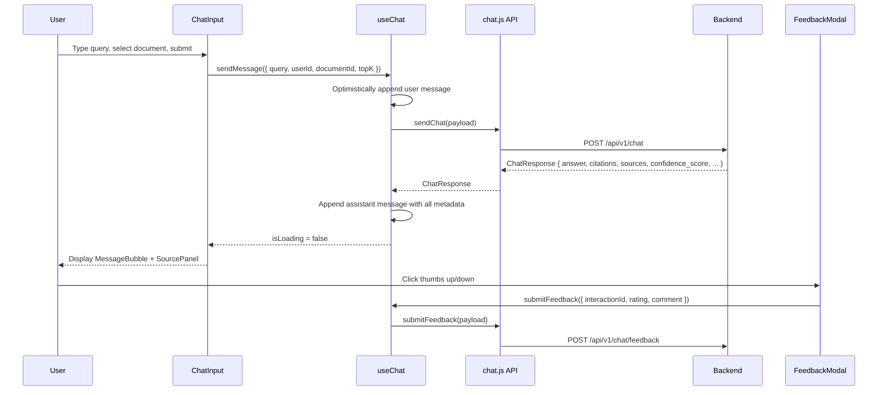
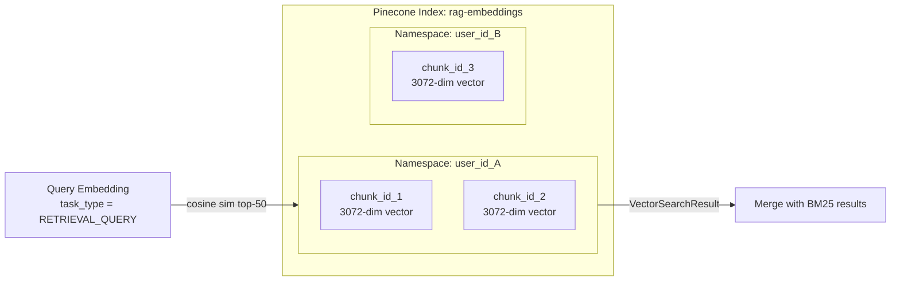
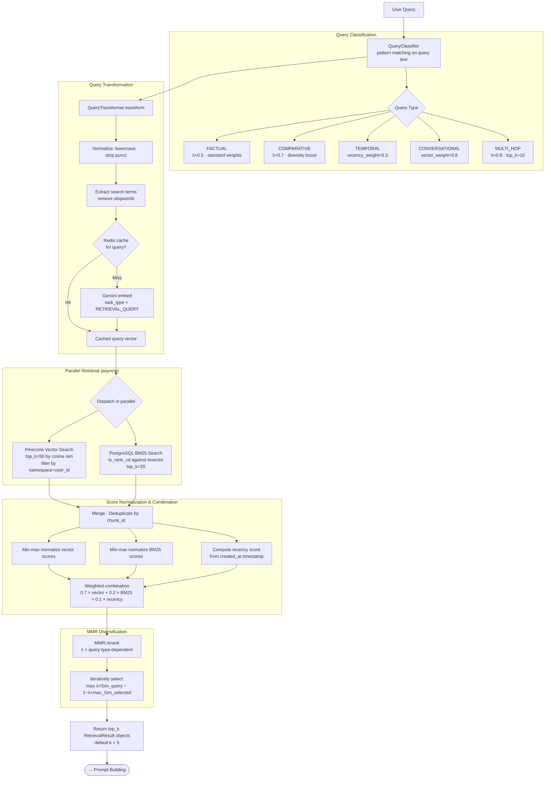
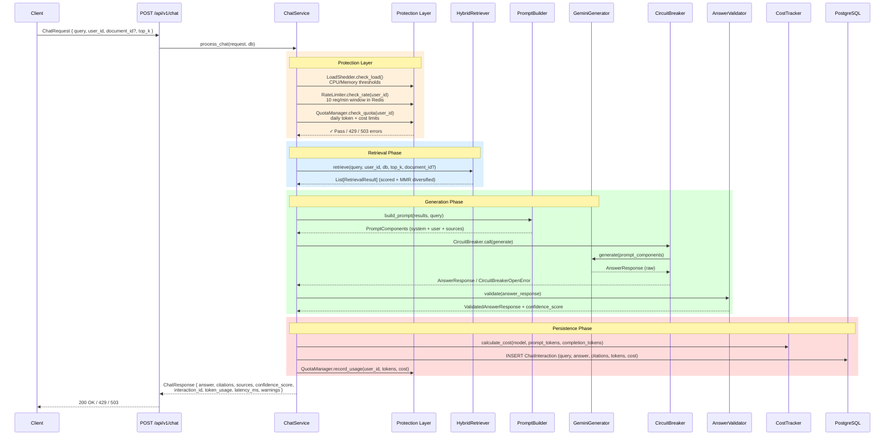
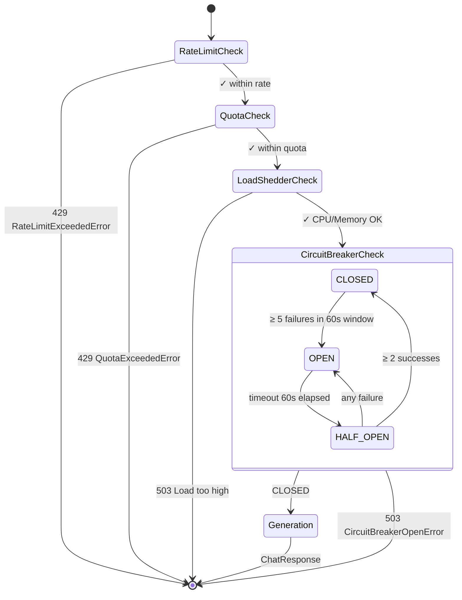
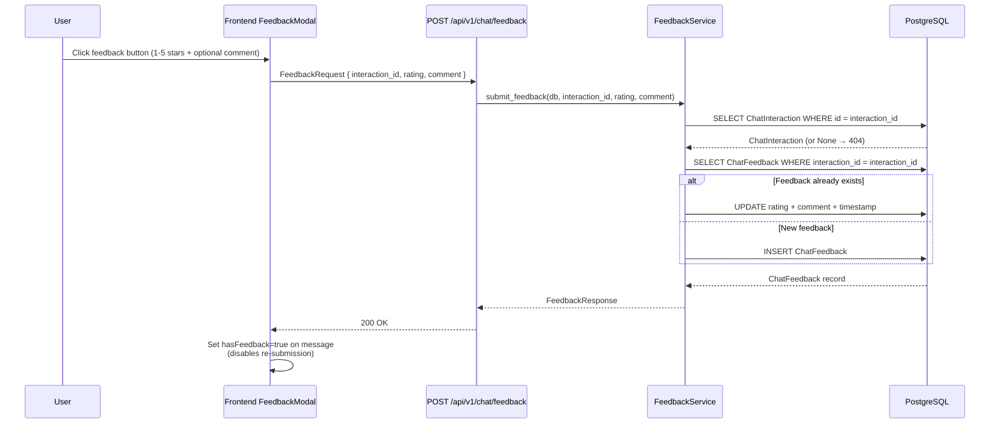
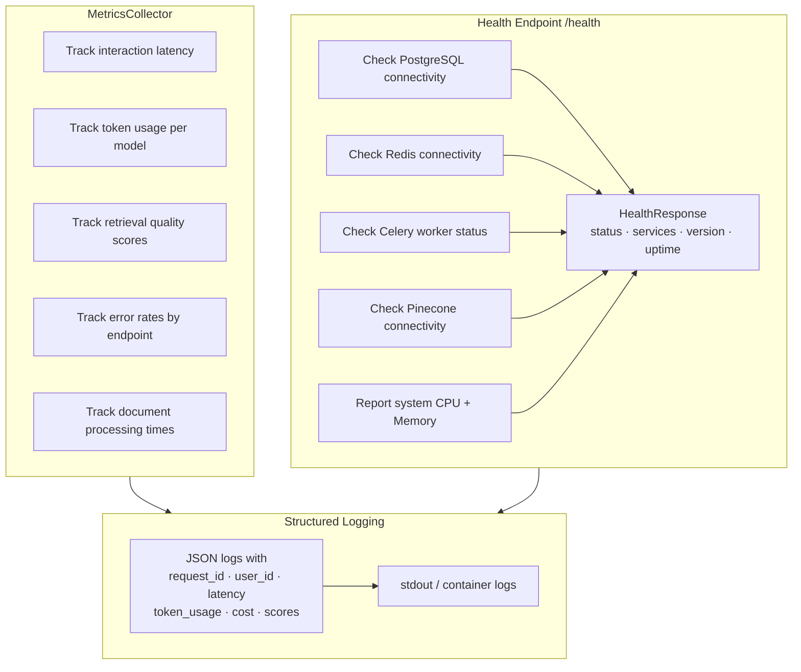

# System Architecture Documentation

> **RAG System** — Production-grade Retrieval-Augmented Generation platform  
> Stack: Next.js · FastAPI · PostgreSQL · Redis · Pinecone · Gemini AI · Celery

---

## Table of Contents

1. [System Overview](#1-system-overview)
2. [Backend Architecture](#2-backend-architecture)
3. [Frontend Architecture](#3-frontend-architecture)
4. [RAG Ingestion Pipeline](#4-rag-ingestion-pipeline)
5. [Parsing and Chunking Flow](#5-parsing-and-chunking-flow)
6. [Embedding and Vector Storage](#6-embedding-and-vector-storage)
7. [Hybrid Retrieval Pipeline](#7-hybrid-retrieval-pipeline)
8. [Prompt Building and Generation](#8-prompt-building-and-generation)
9. [Chat Orchestration](#9-chat-orchestration)
10. [Monitoring and Feedback System](#10-monitoring-and-feedback-system)

---

## 1. System Overview

The RAG System is a full-stack, production-ready Retrieval-Augmented Generation platform. Users upload documents through a Next.js frontend; documents are asynchronously processed by a Celery worker pipeline (parse → chunk → embed → index). At query time, a FastAPI backend orchestrates hybrid retrieval (dense vector search + BM25 sparse search), prompt construction, and Gemini LLM generation, all guarded by a multi-layer protection system.



---

## 2. Backend Architecture

The backend is a **FastAPI** application with async SQLAlchemy for PostgreSQL, an async Redis client, and Celery for background task execution. All configuration is managed via `pydantic-settings` and environment variables.

### Infrastructure Stack

| Component | Technology | Purpose |
|---|---|---|
| Web Framework | FastAPI 0.110+ | Async REST API |
| Database | PostgreSQL 15 | Relational data, BM25 full-text search |
| Cache / Broker | Redis 7 | Embedding cache, rate limits, Celery broker/backend |
| Vector DB | Pinecone | Dense vector similarity search |
| Task Queue | Celery | Async document processing |
| LLM | Gemini 2.0 Flash | Answer generation |
| Embeddings | Gemini `embedding-001` | 3072-dim dense vectors |
| Container | Docker Compose | Multi-service orchestration |



### API Routes

```mermaid
graph LR
    subgraph ChatRoutes["Chat Routes (/api/v1/chat)"]
        C1[POST / — RAG chat query]
        C2[POST /feedback — Submit rating]
        C3[GET /interactions — History]
    end

    subgraph DocRoutes["Document Routes (/documents)"]
        D1[POST /upload — Upload file]
        D2[GET / — List documents]
        D3[GET /{id} — Get document]
        D4[DELETE /{id} — Delete document]
    end

    subgraph HealthRoutes["Health Routes (/health)"]
        H1[GET / — System health]
        H2[GET /services — Service statuses]
    end

    subgraph Middleware["Middleware Stack"]
        MW1[CORSMiddleware<br/>allow_origins from config]
        MW2[RequestIDMiddleware<br/>X-Request-ID header]
        MW3[Exception Handlers<br/>BaseAPIException · HTTP · Validation]
    end
```

### Database Schema



---

## 3. Frontend Architecture

The frontend is a **Next.js 14** App Router application using CSS Modules for styling and React Context for global state. There is no Redux — all state is held in `AppContext` and local component state via custom hooks.

```mermaid
graph TB
    subgraph AppShell["App Shell (layout.js)"]
        PROVIDERS[Providers<br/>AppProvider · ThemeProvider]
        SIDEBAR[Sidebar<br/>Navigation links]
        TOPBAR[Topbar<br/>Theme toggle · User ID]
        CONTENT[Page Content Slot]
    end

    subgraph Pages["Pages (App Router)"]
        DASH[/ — Dashboard<br/>Stats · Quick links]
        CHATPAGE[/chat — Chat<br/>Message thread · Source panel]
        DOCPAGE[/documents — Documents<br/>Upload · Status cards]
        HEALTHPAGE[/health — Health<br/>Service grid · Metrics]
    end

    subgraph StateLayer["State Layer"]
        APPCTX[AppContext<br/>userId · documents · selectedDocumentId<br/>addDocument · updateDocument]
        UC[useChat<br/>messages · isLoading · sendMessage · submitFeedback]
        UD[useDocuments<br/>upload · poll · delete]
        UH[useHealth<br/>health data · isHealthy]
        UT[useTheme<br/>theme · toggleTheme]
    end

    subgraph APILib["API Library"]
        CLI[client.js<br/>apiFetch wrapper]
        CHATAPI[chat.js<br/>sendChat · submitFeedback]
        DOCAPI[documents.js<br/>uploadDocument · getDocument · deleteDocument]
        HAPI[health.js<br/>getHealth]
    end

    subgraph ChatComponents["Chat Components"]
        CW[ChatWindow<br/>message list · auto-scroll]
        CI[ChatInput<br/>query input · doc selector · submit]
        MB[MessageBubble<br/>user/assistant · citations · confidence]
        DS[DocumentSelector<br/>dropdown · filter completed]
        FM[FeedbackModal<br/>1-5 star rating · comment]
        SP[SourcePanel<br/>retrieved chunks · scores]
    end

    subgraph DocComponents["Document Components"]
        DC[DocumentCard<br/>status badge · actions]
        DZ[DropZone<br/>drag & drop · file picker]
        PS[ProcessingStatus<br/>progress indicator · polling]
    end

    PROVIDERS --> APPCTX
    Pages --> StateLayer
    StateLayer --> APILib
    APILib --> CLI
    CHATPAGE --> ChatComponents
    DOCPAGE --> DocComponents
```

### Data Flow: Chat



---

## 4. RAG Ingestion Pipeline

Documents uploaded through the API are stored, registered in PostgreSQL, and then processed asynchronously by a Celery worker that executes a six-stage pipeline. Status transitions are tracked throughout.

```mermaid
flowchart TD
    A([User uploads file via POST /documents/upload]) --> B

    subgraph Validation["IngestionManager — Validation"]
        B[Validate file extension<br/>.pdf · .docx · .pptx · .txt]
        B --> C[Validate file size ≤ 25 MB]
        C --> D[Generate document UUID]
    end

    D --> E

    subgraph Storage["Storage"]
        E[Save binary to local storage<br/>storage/{user_id}/{doc_id}/{filename}]
        E --> F[Create Document record in PostgreSQL<br/>status = UPLOADED]
    end

    F --> G[Return DocumentUploadResponse to client]
    F --> H

    subgraph CeleryTask["Celery Task: process_document<br/>max_retries=3 · exponential backoff: 1s→2s→4s→8s"]
        H[Set status = PROCESSING]
        H --> I[Load file from storage path]
        I --> J

        subgraph Parsing["Parsing"]
            J[ParserFactory.get_parser document_type]
            J --> K[Parse document → ParsedDocument<br/>sections · metadata]
            K --> L[Normalizer: clean whitespace, fix encoding]
        end

        L --> M[Set status = PARSED]
        M --> N

        subgraph Chunking["Chunking"]
            N[SemanticChunker.chunk_document<br/>max_tokens=500 · overlap=100]
            N --> O[HierarchicalChunker: map section hierarchy<br/>Level 0: Doc → Level 1: Section → Level 2: Chunk]
            O --> P[Generate content_hash per chunk]
        end

        P --> Q[Set status = CHUNKED]
        Q --> R

        subgraph Embedding["Embedding"]
            R[EmbeddingService.embed_chunks]
            R --> S{Cache hit<br/>in Redis?}
            S -- Yes --> T[Reuse cached embedding]
            S -- No --> U[Gemini embedding-001 API<br/>3072-dim vector]
            U --> V[Cache in Redis]
            T --> W[Attach embedding to chunk]
            V --> W
        end

        W --> X[Set status = EMBEDDED]
        X --> Y

        subgraph Indexing["Indexing"]
            Y[VectorService.store_document_chunks<br/>Upsert to Pinecone namespace=user_id]
            Y --> Z[ChunkService.bulk_create_chunks<br/>Insert into PostgreSQL with TSVECTOR index]
        end

        Z --> AA[Set status = COMPLETED]
    end

    AA --> AB([Document ready for retrieval])

    classDef status fill:#2d6a4f,color:#fff
    class H,M,Q,X,AA status
```

---

## 5. Parsing and Chunking Flow

### Parser Factory

Four format-specific parsers are dispatched by `ParserFactory` based on file extension. Each parser produces a `ParsedDocument` with a list of `ParsedSection` objects.

```mermaid
graph TD
    PF[ParserFactory.get_parser extension]

    PF --> PDF[PDFParser<br/>pypdf / pdfplumber<br/>extracts pages → sections<br/>preserves page numbers]
    PF --> DOCX[DocxParser<br/>python-docx<br/>maps headings → sections<br/>preserves section titles]
    PF --> PPTX[PPTXParser<br/>python-pptx<br/>maps slides → sections<br/>title + body text]
    PF --> TXT[TextParser<br/>UTF-8 / fallback encoding<br/>paragraph splitting]

    PDF --> NORM
    DOCX --> NORM
    PPTX --> NORM
    TXT --> NORM

    NORM[Normalizer<br/>strip extra whitespace<br/>fix encoding artefacts<br/>remove null bytes]

    NORM --> PD[ParsedDocument<br/>document_id · sections[] · metadata]
```

### Chunking Strategy

```mermaid
flowchart LR
    PD[ParsedDocument<br/>sections] --> SC

    subgraph SemanticChunker["SemanticChunker (max_tokens=500, overlap=100)"]
        SC[Iterate sections]
        SC --> SMALL{section tokens\n< min_chunk_tokens\n= 50?}
        SMALL -- Yes --> MERGE[Merge with next section]
        SMALL -- No --> LARGE{section tokens\n> max_tokens?}
        LARGE -- Yes --> SPLIT[Split with overlap window<br/>overlap = 100 tokens]
        LARGE -- No --> KEEP[Keep as single chunk]
        MERGE --> CHUNK
        SPLIT --> CHUNK
        KEEP --> CHUNK
        CHUNK[Assign chunk_index<br/>copy section metadata<br/>compute content_hash]
    end

    CHUNK --> HC

    subgraph HierarchicalChunker["HierarchicalChunker"]
        HC[Map section_id → ParsedSection<br/>parent layer]
        HC --> GM[Group chunks by parent_section_id<br/>child layer]
    end

    GM --> CD[ChunkedDocument<br/>chunks[] with parent_section_id links]
```

---

## 6. Embedding and Vector Storage

### Embedding Pipeline

```mermaid
flowchart TD
    CHUNKS[List of Chunk objects] --> ES

    subgraph EmbeddingService["EmbeddingService"]
        ES[Deduplicate by content_hash]
        ES --> BATCH[Split into batches]
        BATCH --> CCHK{Redis cache\nhit per hash?}
        CCHK -- Hit --> HIT[Retrieve cached vector]
        CCHK -- Miss --> GCALL[GeminiEmbeddingClient.embed_batch<br/>task_type = RETRIEVAL_DOCUMENT]
        GCALL --> RETRY[Retry: 1s → 2s → 4s on rate limit / timeout]
        RETRY --> CACHE[Store vector in Redis<br/>key: embedding:{content_hash}]
        HIT --> ATTACH
        CACHE --> ATTACH
        ATTACH[Attach embedding to EmbeddedChunk]
    end

    ATTACH --> VS

    subgraph VectorService["VectorService → PineconeClient"]
        VS[Build VectorRecord per chunk<br/>id · values · metadata]
        VS --> META["Metadata: document_id · chunk_index\nsection_title · page_number\nuser_id · filename"]
        META --> UP[Pinecone upsert batch<br/>namespace = user_id]
    end

    UP --> PGSTORE

    subgraph ChunkService["ChunkService → PostgreSQL"]
        PGSTORE[bulk_create_chunks<br/>INSERT INTO document_chunks<br/>with TSVECTOR search_vector]
    end

    PGSTORE --> IDX[(Pinecone Index<br/>3072-dim · cosine similarity<br/>+ PostgreSQL tsvector index)]
```

### Pinecone Architecture



---

## 7. Hybrid Retrieval Pipeline

The retrieval engine combines **dense vector search** (Pinecone, semantic similarity) with **sparse BM25 search** (PostgreSQL `tsvector`, keyword matching) to maximize both recall and precision. Results are merged, scored, and diversified using **MMR**.



---

## 8. Prompt Building and Generation

### Prompt Construction

```mermaid
flowchart TD
    RESULTS[List of RetrievalResult] --> CTX_OPT

    subgraph ContextOptimizer["ContextOptimizer"]
        CTX_OPT[Rank chunks by score]
        CTX_OPT --> BUDGET[TokenBudgetManager<br/>MODEL_MAX_TOKENS = 1,048,576<br/>MAX_OUTPUT_TOKENS = 8,192]
        BUDGET --> TRIM[Fit context within budget<br/>reserve space for system + query + output]
        TRIM --> SELECTED[Selected chunks with token allocation]
    end

    SELECTED --> SF

    subgraph SourceFormatter["SourceFormatter"]
        SF[Format each chunk as:\n[Source N]\nTitle: section_title\nPage: page_number\nContent: ...]
        SF --> MAP[Build source_mapping Dict<br/>N → {document_id, chunk_id, section_title, ...}]
    end

    MAP --> PB

    subgraph PromptBuilder["PromptBuilder"]
        PB[Assemble PromptComponents]
        PB --> SYS["System prompt:\n• Answer ONLY from sources\n• [Source X] citation format\n• Explicit no-info statement\n• Anti-hallucination rules"]
        PB --> USER["User prompt:\n{formatted_sources}\n\nQuestion: {query}"]
        PB --> TOKENS[Count total tokens]
    end

    USER --> GG
    SYS --> GG

    subgraph GeminiGenerator["GeminiGenerator"]
        GG[Configure GenerativeModel<br/>model=gemini-2.0-flash<br/>temperature=0.1<br/>max_output_tokens=8192]
        GG --> RETRY2[generate_content with\nexponential backoff\n1s → 2s → 4s]
        RETRY2 --> RESP[Extract text + usage_metadata]
    end

    RESP --> AV

    subgraph AnswerValidator["AnswerValidator"]
        AV[Parse citations: \[Source \d+\] pattern]
        AV --> VALID[Validate each citation\nagainst source_mapping keys]
        VALID --> HALL{Hallucination\nchecks}
        HALL --> H1[No citations present?]
        HALL --> H2[Invalid citation numbers?]
        HALL --> H3[Generic non-answer statements?]
        H1 --> CONF
        H2 --> CONF
        H3 --> CONF
        CONF["Confidence Score\n0.4 × citation_quality\n+ 0.3 × validity_score\n+ 0.2 × citation_density\n+ 0.1 × certainty_score"]
    end

    CONF --> AR[AnswerResponse\nanswer · citations · confidence_score\ntoken_usage · latency_ms · warnings\nhas_hallucinations · invalid_citations]
```

---

## 9. Chat Orchestration

`ChatService` is the central orchestrator that wires together the protection layer, retrieval, generation, and persistence layers in a single atomic request flow.



### Protection Layer State Machine



---

## 10. Monitoring and Feedback System

### Feedback Flow



### Cost Tracking

```mermaid
flowchart LR
    GENERATION[LLM Generation\ncompleted] --> CT

    subgraph CostTracker
        CT[calculate_cost\nmodel · prompt_tokens · completion_tokens]
        CT --> PRICE{Model pricing table}
        PRICE --> G2F["gemini-2.0-flash\ninput: $0.075/1M\noutput: $0.30/1M"]
        PRICE --> G15P["gemini-1.5-pro\ninput: $0.125/1M\noutput: $0.375/1M"]
        PRICE --> EMB["embedding-001\ninput: $0.01/1M"]
        G2F --> CALC
        G15P --> CALC
        EMB --> CALC
        CALC["cost = tokens/1M × price_per_million"]
    end

    CALC --> QM

    subgraph QuotaManager
        QM[record_usage\nuser_id · tokens · cost]
        QM --> RED[Redis INCR\ndaily_tokens:{user_id}:{date}]
        QM --> RCOST[Redis INCRBYFLOAT\ndaily_cost:{user_id}:{date}]
        RED --> CHECK{Check against\nlimits}
        RCOST --> CHECK
        CHECK --> DAILY_TK["DAILY_TOKEN_LIMIT\n= 1,000,000 tokens"]
        CHECK --> DAILY_COST["DAILY_COST_LIMIT\n= $10.00 USD"]
    end

    CALC --> PERSIST[Persist cost_usd\nin ChatInteraction record]
```

### Metrics and Monitoring



---

## Component Dependency Map

```mermaid
graph BT
    %% Data layer
    PG[(PostgreSQL)]
    REDIS[(Redis)]
    PINE[(Pinecone)]
    FS[(File Storage)]

    %% Infrastructure
    GC[GeminiEmbeddingClient] --> REDIS
    PC[PineconeClient] --> PINE
    CS_DB[ChunkService] --> PG
    IM[IngestionManager] --> FS
    IM --> PG

    %% Embedding
    EC[EmbeddingCache] --> REDIS
    ES[EmbeddingService] --> GC
    ES --> EC

    %% Vector
    VS[VectorService] --> PC
    VS --> ES

    %% Retrieval
    BM25[BM25Service] --> PG
    QT[QueryTransformer] --> ES
    QT --> EC
    QC[QueryClassifier]
    SCORING[ScoringService]
    MMR_C[MMR]
    HR_C[HybridRetriever] --> PC
    HR_C --> BM25
    HR_C --> QT
    HR_C --> QC
    HR_C --> SCORING
    HR_C --> MMR_C
    HR_C --> CS_DB

    %% Generation
    GEN[GeminiGenerator]
    TB[TokenBudgetManager]
    CO[ContextOptimizer] --> TB
    SF_C[SourceFormatter]
    PB_C[PromptBuilder] --> CO
    PB_C --> SF_C
    PB_C --> TB
    AV_C[AnswerValidator]
    CT_C[CostTracker]

    %% Protection
    RL[RateLimiter] --> REDIS
    QM[QuotaManager] --> REDIS
    CB_C[CircuitBreaker]
    LS[LoadShedder]

    %% Orchestration
    CHAT_SVC[ChatService] --> HR_C
    CHAT_SVC --> PB_C
    CHAT_SVC --> GEN
    CHAT_SVC --> CB_C
    CHAT_SVC --> AV_C
    CHAT_SVC --> CT_C
    CHAT_SVC --> RL
    CHAT_SVC --> QM
    CHAT_SVC --> LS
    CHAT_SVC --> PG

    %% Monitoring
    FB_SVC[FeedbackService] --> PG

    %% Workers
    TASK[Celery Task] --> IM
    TASK --> ES
    TASK --> VS
    TASK --> CS_DB

    %% API
    CHAT_API[/api/v1/chat] --> CHAT_SVC
    CHAT_API --> FB_SVC
    DOC_API[/documents] --> IM
    DOC_API --> TASK
```

---

*Generated: March 2026 — reflects codebase at `rag_system/` + `frontend/`*
